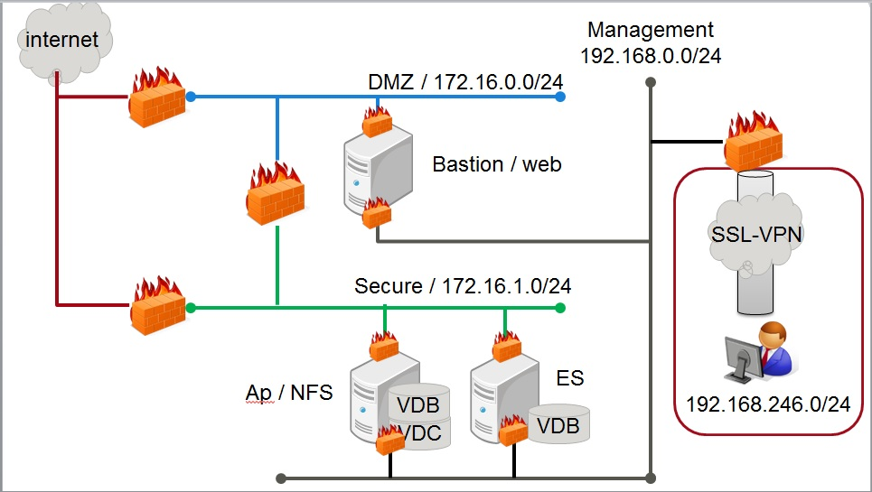

# 3-server Heat

## Overview
このHeatTemplateは、OpenStackでPersonium ３Serverユニット用の
ネットワーク、サーバを作成するTemplateのサンプルです。    
動作確認はFUJITSU Cloud Service K5 で行っています。  
このTemplateで作成できる構成を以下に示します。  

  

注意:インターネットに接続するネットワーク、SSL-VPN接続はこのTemplateの対象外です。
## File structure
| File name | Contents |
|---|---|
| 01_personium_network.yaml  |		NetworkおよびFirewallの作成を行います。|
| 02_personium_server.yaml	   |		01_personium_network.yamlで作成したネットワークにpersonium用のサーバを作成します。|    

## 作成の流れ
このHeatTemplateを使用した作成の流れについて説明します。

### 1: Keypairの作成
PerosniumサーバにログインするためのKeyPairを作成します。

### 2: ネットワークの作成
01_personium_network.yamlを使用して、ネットワークを作成します。  

### 3: 外部ネットワークとの接続
DMZネットワーク、Secureネットワーク、Managementネットワークを外部ネットワークと接続します。

### 4: サーバ作成準備
02_personium_server.yamlを編集します。   

1.ネットワークID設定  
作成されたネットワークのIDを取得して、ParametersセクションのネットワークIDを編集します。
```
#DMZ ネットワークID
dmz_network_id:
  type: string
  description: ID of the dmz network.
  default: { dmz_network_id } #set dmz network id.

#SECURE ネットワークID
secure_network_id:
  type: string
  description: ID of the secure network.
  default: { secure_network_id } #set secure network id.

#Management ネットワークID
mng_network_id:
  type: string
  description: ID of the management network.
  default: { management_network_id } #set management network id.
```

2.KeyPair設定  
作成したKeyPariの名前を取得して、ParametersセクションのKeyPair名を編集します。
```
#WebサーバKey名
web_server_key_name:
  type: string
  description: Name of web server key.
  default: { your_server_keyname } #set server key name.

#APサーバKey名
ap_server_key_name:
  type: string
  description: Name of ap server key.
  default: { your_server_keyname } #set server key name.

#ESサーバKey名
es_server_key_name:
  type: string
  description: Name of es server key.
  default: { your_server_keyname } #set server key name.
  ```

3.証明書設定  
resourceセクションのwebサーバの証明書設定を編集します。
  ```
  openssl genrsa 2048 > /root/ansible/resource/web/opt/nginx/conf/server.key
  openssl req -new -key /root/ansible/resource/web/opt/nginx/conf/server.key << EOF > /root/ansible/resource/web/opt/nginx/conf/server.csr
  { Country Name } # set country name
  { State or Province Name } # set state name
  { Locality Name } # set locality name
  { Organization Name } # set oganization name
  { Organizational Unit Name } # set oganization unit name
  { Common Name } # set common name
  { Email Address } # set mail address
  { A challenge password } # set password
  { An optional company name } # set company name
  EOF
  openssl x509 -days 3650 -req -signkey /root/ansible/resource/web/opt/nginx/conf/server.key < /root/ansible/resource/web/opt/nginx/conf/server.csr > /root/ansible/resource/web/opt/nginx/conf/server.crt


  openssl genrsa -out /root/ansible/resource/ap/opt/x509/unit.key 2048 -outform DER
  openssl req -new -key /root/ansible/resource/ap/opt/x509/unit.key -out /root/ansible/resource/ap/opt/x509/unit.csr << EOF
  { Country Name } # set country name
  { State or Province Name } # set state name
  { Locality Name } # set locality name
  { Organization Name } # set oganization name
  { Organizational Unit Name } # set oganization unit name
  { Common Name } # set common name
  { Email Address } # set mail address
  { A challenge password } # set password
  { An optional company name } # set company name
  EOF
  ```
### 5: SSL-VPN作成
ManagementネットワークにSSL-VPN接続を作成します。

### 6: ansible実行
以下の手順を参照して、ansibleを実行します。  
[ansible/3-server_unit](https://github.com/personium/ansible/tree/master/3-server_unit "3-server_unit")
