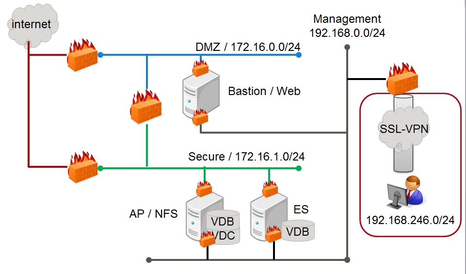

# Personium 3serverユニット作成用HeatTemplate

## 概要
このHeatTemplateは、OpenStackでPersonium 3Serverユニット用のネットワークおよびサーバ構成を自動構築するものです。

#### 前提条件
 * 動作確認はOpenStackベースIaaSの FUJITSU Cloud Service K5 で行っています。
 * インターネットに接続するネットワーク、サーバアクセス用SSL-VPN接続はこのHeatTemplateの作成対象外です。

## 構築環境
このHeatTemplateで作成できる構成を以下に示します。  

  

## ファイル構成
| File name | Contents |
|:---:|:---:|
| 01_personium_network.yaml  |ネットワークおよびファイアウォールの作成を行います。|
| 02_personium_server.yaml   |Personium用のサーバ群を作成します。|


## 作成の流れ
このHeatTemplateを使用した作成の流れについて説明します。

### 1: Keypairの作成
Personium用のサーバにログインするためのKeyPairを作成します。

### 2:ネットワーク作成準備
01_personium_network.yamlを編集します。

 *  Parametersセクションのavailability_zoneのdefaultに、使用しているアベイラビリティゾーンを設定します。
```
  availability_zone:
    type: string
    description: Availability zone
    default: { Availability zone } # set Availability zone
```

### 3: ネットワークの作成
01_personium_network.yamlを使用して、ネットワークを作成します。  

### 4: 外部ネットワークとの接続
DMZネットワーク、Secureネットワーク、Managementネットワークを外部ネットワークと接続します。

### 5: サーバ作成準備
02_personium_server.yamlを編集します。   

 *  使用しているアベイラビリティゾーンをParametersセクションのavailability_zoneのdefaultに設定します。
```
  availability_zone:
    type: string
    description: Availability zone
    default: { Availability zone } # set Availability zone
```

 *  ネットワークID設定  
作成されたネットワークのIDを取得して、Parametersセクションのdmz_network_id、secure_network_id、mng_network_idのdefaultに設定します。
```
dmz_network_id:
  type: string
  description: ID of the dmz network.
  default: { dmz_network_id } #set dmz network id.
```
```
secure_network_id:
  type: string
  description: ID of the secure network.
  default: { secure_network_id } #set secure network id.
```
```
mng_network_id:
  type: string
  description: ID of the management network.
  default: { management_network_id } #set management network id.
```

 *  KeyPair設定  
作成したKeyPairの名前を取得して、Parametersセクションの  
web_server_key_name、ap_server_key_name、es_server_key_nameのdefaultに設定します。
```
web_server_key_name:
  type: string
  description: Name of web server key.
  default: { your_server_keyname } #set server key name.
```
```
ap_server_key_name:
  type: string
  description: Name of ap server key.
  default: { your_server_keyname } #set server key name.
```
```
es_server_key_name:
  type: string
  description: Name of es server key.
  default: { your_server_keyname } #set server key name.
```

 *  証明書設定  
resourcesセクションのweb_serverのuser_dataを作成する証明書に合わせて編集します。
```
  web_server:
    type: OS::Nova::Server
    properties:

        --中略--

    user_data_format: RAW
    user_data:
      str_replace:
        template: |
          #!/bin/bash -v

    　　--中略--

          openssl genrsa 2048 > /root/ansible/resource/web/opt/nginx/conf/server.key
          openssl req -new -key /root/ansible/resource/web/opt/nginx/conf/server.key << EOF > /root/ansible/resource/web/opt/nginx/conf/server.csr
          { Country Name } # set country name
          { State or Province Name } # set state name
          { Locality Name } # set locality name
          { Organization Name } # set oganization name
          { Organizational Unit Name } # set oganization unit name
          { Common Name } # set common name
          { Email Address } # set mail address
          { A challenge password } # set password
          { An optional company name } # set company name
          EOF
          openssl x509 -days 3650 -req -signkey  /root/ansible/resource/web/opt/nginx/conf/server.key < /root/ansible/resource/web/opt/nginx/conf/server.csr > /root/ansible/resource/web/opt/nginx/conf/server.crt

          openssl genrsa -out /root/ansible/resource/ap/opt/x509/unit.key 2048 -outform DER
          openssl req -new -key /root/ansible/resource/ap/opt/x509/unit.key -out /root/ansible/resource/ap/opt/x509/unit.csr << EOF
          { Country Name } # set country name
          { State or Province Name } # set state name
          { Locality Name } # set locality name
          { Organization Name } # set oganization name
          { Organizational Unit Name } # set oganization unit name
          { Common Name } # set common name
          { Email Address } # set mail address
          { A challenge password } # set password
          { An optional company name } # set company name
          EOF

          openssl x509 -req -days 3650 -signkey /root/ansible/resource/ap/opt/x509/unit.key -out /root/ansible/resource/ap/opt/x509/unit-self-sign.crt < /root/ansible/resource/ap/opt/x509/unit.csr
```

### 6: SSL-VPN作成（手動）
ManagementネットワークにSSL-VPN接続を作成します。

### 7: Personiumセットアップ
以下の手順を参照して、Personiumのセットアップを行います。  
[ansible/3-server_unit](https://github.com/personium/ansible/tree/master/3-server_unit "3-server_unit")
